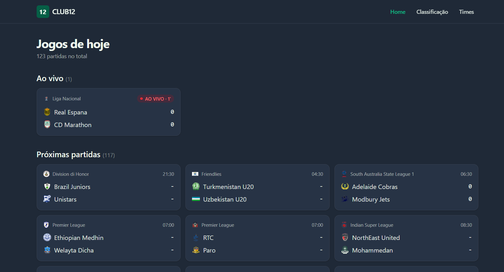
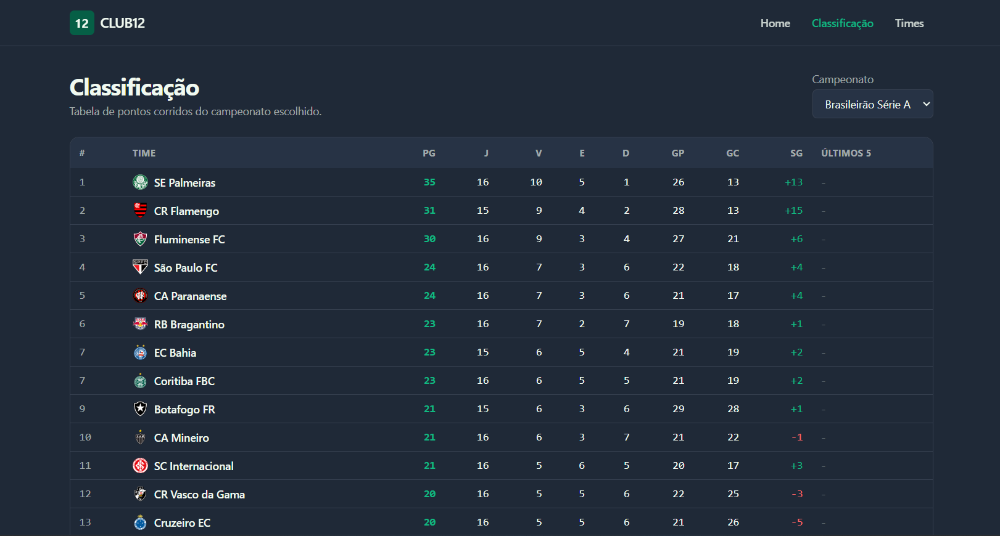
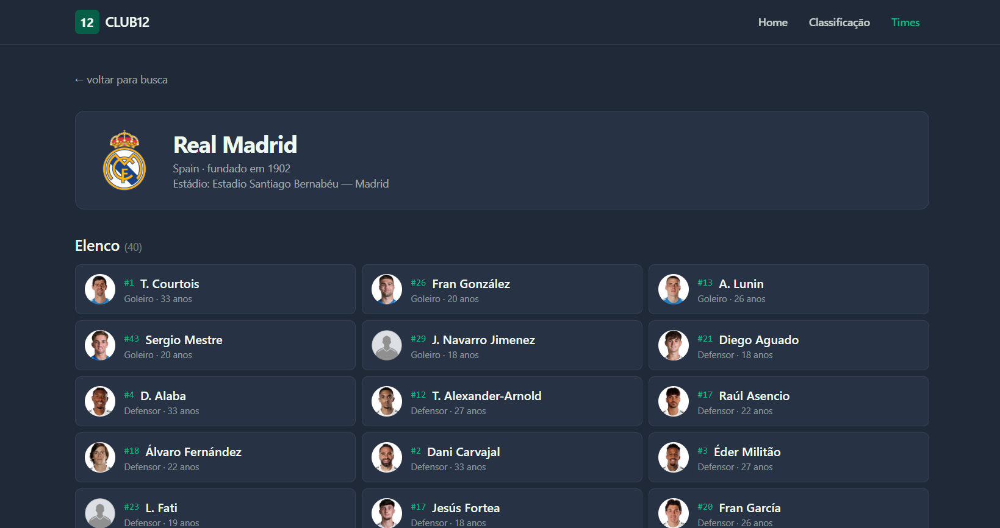
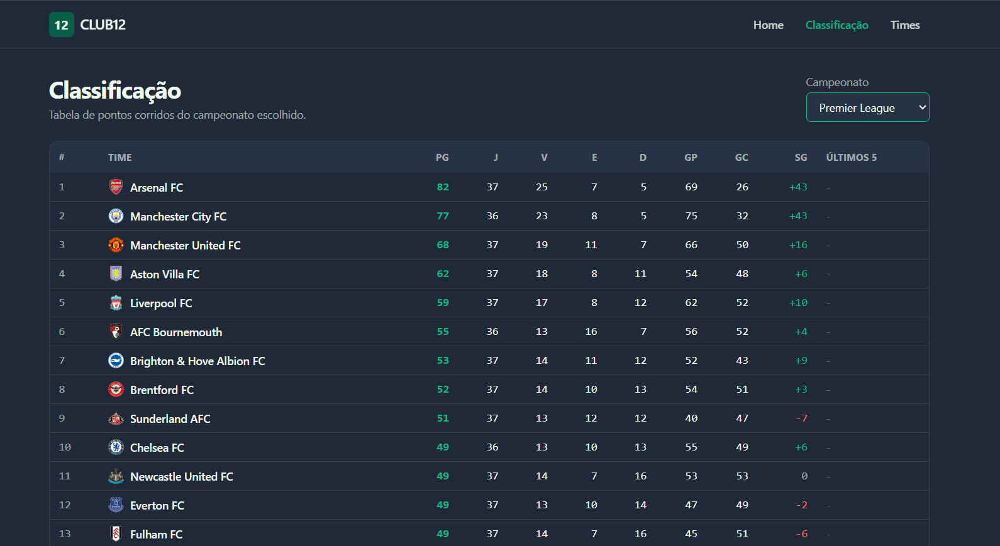
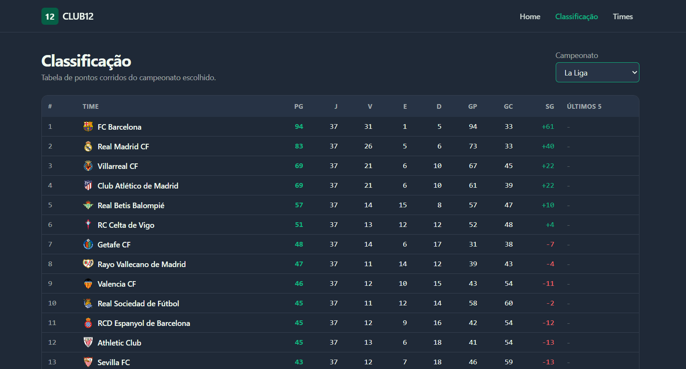
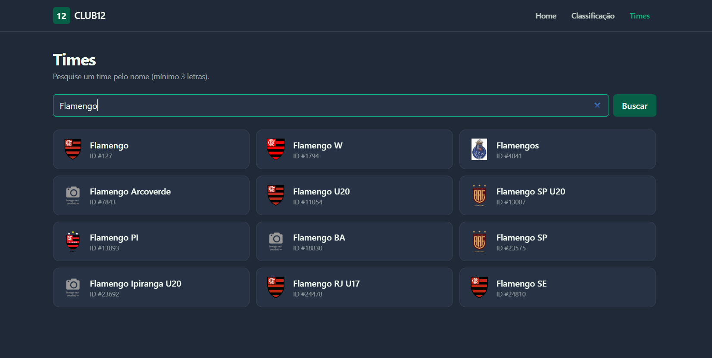
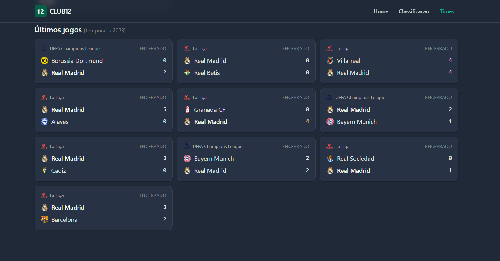

# CLUB12

Plataforma de futebol fullstack com jogos ao vivo, classificações e perfis de times. Projeto pessoal.


> 🌐 **Demo ao vivo:** **https://club12.netlify.app**
> Frontend no Netlify, backend ([API](https://club12-api.onrender.com)) no Render.
> A primeira visita pode demorar até 1 minuto: o plano gratuito do Render hiberna o backend após 15min de inatividade e leva alguns segundos para acordar.

> 🔌 **Multi-provider:** o projeto usa **duas APIs gratuitas em paralelo**, a API-Football para jogos do dia, times e elencos, e a football-data.org especificamente para classificações da temporada atual. Decisão arquitetural intencional: cada fonte é usada onde seu plano gratuito é mais generoso.

---

## Demonstração



| Classificação | Detalhe do time |
|---|---|
|  |  |

---

## Stack

| Camada | Tecnologia | Por quê |
|---|---|---|
| Frontend | React 19 + Vite | Build tool moderno, hot reload instantâneo |
| Estilo | TailwindCSS v4 | Utilitários + tema CSS-first |
| Roteamento | React Router DOM 7 | Padrão de mercado |
| HTTP cliente | Axios | Interceptors e ergonomia |
| Backend | Python 3.13 + FastAPI | Async nativo, tipagem, `/docs` automático |
| HTTP servidor | Uvicorn | ASGI rápido com hot reload |
| Validação | Pydantic v2 | Schemas que viram documentação |
| HTTP outbound | httpx | Cliente async |
| Configuração | pydantic-settings | `.env` tipado |
| Dados — jogos, times, elencos | [API-Football](https://www.api-football.com/) | Plano gratuito (100 req/dia) |
| Dados — classificações atuais | [football-data.org](https://www.football-data.org/) | Plano gratuito (10 req/min, sem limite diário) |

---

## Arquitetura

```
                                                            ┌──────────────────────┐
                                                       ┌───▶│   API-Football       │
                                                       │    │  (jogos/times)       │
┌──────────────┐    HTTP/JSON     ┌───────────────────┐│    └──────────────────────┘
│   Frontend   │ ───────────────▶ │      Backend      ││
│ React + Vite │                  │     FastAPI       │┤
└──────────────┘                  └───────────────────┘│    ┌──────────────────────┐
       │                                    │          └───▶│  football-data.org   │
       │  pages, components, hooks          │               │  (classificações)    │
       │  estado local (useState)           │               └──────────────────────┘
       │                                    │
       │                                    │  routers → services (1 por provedor)
       └──── http://localhost:5173          └──── http://localhost:8000
```

Cada router escolhe **qual service** chamar, mas todos devolvem schemas Pydantic comuns. O frontend não sabe (nem precisa saber) quantos provedores estão envolvidos.

**Backend — separação em camadas:**

```
backend/app/
├── main.py            ponto de entrada FastAPI + CORS
├── config.py          settings centralizadas (lê .env)
├── routers/           rotas HTTP (recebem request, traduzem erros)
│   ├── fixtures.py
│   ├── standings.py
│   └── teams.py
├── services/          lógica de negócio (1 adapter por provedor externo)
│   ├── api_football.py     (jogos, times, elencos)
│   └── football_data.py    (classificações da temporada atual)
├── schemas/           contratos Pydantic
│   ├── fixture.py
│   ├── standing.py
│   └── team.py
└── models/            (reservado para tabelas do Postgres na fase de cache)
```

**Frontend — separação por responsabilidade:**

```
frontend/src/
├── main.jsx           bootstrap + BrowserRouter
├── App.jsx            layout (Navbar + Routes + Footer)
├── pages/             telas (uma por rota)
├── components/
│   ├── layout/        Navbar, Footer
│   └── matches/       MatchCard, LiveBadge (reutilizados em Home e detalhes)
├── hooks/             custom hooks de fetch (useFixtures, useTeam, etc.)
├── services/          cliente Axios (api.js)
└── lib/               helpers puros (fixtureStatus.js)
```

---

## Funcionalidades

- **Home (`/`)** — jogos do dia em três seções (ao vivo, próximos, encerrados) com badge pulsante para partidas ao vivo
- **Classificação (`/classificacao`)** — tabela completa **da temporada atual** do campeonato escolhido (Brasileirão, Premier League, La Liga, Serie A, Bundesliga, Ligue 1) com cores semânticas para saldo e bolinhas de "últimos 5 jogos"
- **Times (`/times`)** — busca por nome (mínimo 3 letras) com grid de resultados
- **Detalhe do time (`/times/:id`)** — header com escudo/estádio/ano de fundação, elenco completo e últimos 10 jogos da temporada
- **404 (`/qualquer-coisa`)** — página de erro amigável com link para voltar

Todas as páginas:
- Tratam três estados de fetch: **loading / error / data**
- Têm título de aba dinâmico (`Classificação · CLUB12`, `Palmeiras · CLUB12`)
- São responsivas (1 coluna no mobile, 2 no tablet, 3 no desktop)

---

## Decisões técnicas

| Decisão | Por quê |
|---|---|
| **Arquitetura em camadas no backend** | Trocar de provedor de dados = mudar só o `services/`. Routers e frontend não tocam. Já foi exercitado: standings migraram de API-Football para football-data.org **sem mexer no frontend** nem nos schemas. |
| **Multi-provider transparente** | Dois adapters distintos (`api_football.py` e `football_data.py`) implementam funções com a mesma assinatura. Router escolhe qual chamar. Padrão **Adapter**. |
| **Schemas Pydantic como fachada** | Frontend não depende do formato cru (e instável) de nenhuma API externa. |
| **Códigos HTTP semânticos** | `503` para upstream caído, `502` para erro de rede, `404` para time inexistente. |
| **Custom hooks para fetch** | Cada página fica com 3-5 linhas de lógica de dados; a complexidade (cancellation, loading, erro) mora num único lugar. |
| **Curadoria de ligas via endpoint** | `/standings/leagues` devolve a lista — frontend não conhece IDs mágicos. |
| **Cancellation flag em useEffect** | Evita race conditions ao navegar entre páginas durante um fetch. |
| **`Promise.all` para chamadas paralelas** | A página de detalhes do time roda 3 GETs simultâneos (~200 ms total) em vez de encadeados (~600 ms). |
| **Variáveis de ambiente isoladas** | `.env` no `.gitignore`, `.env.example` versionado. `pydantic-settings` valida na subida. |
| **Tema com Tailwind v4 `@theme`** | Paleta da marca em um lugar só (`index.css`), vira utilitários automaticamente. |
| **Reuso de componentes** | `MatchCard` aparece na Home **e** no detalhe do time, sem nenhuma adaptação. |

---

## Como rodar localmente

### Pré-requisitos
- Python 3.10+
- Node 18+
- Chave gratuita da [API-Football](https://dashboard.api-football.com/register) (jogos, times, elencos)
- Chave gratuita da [football-data.org](https://www.football-data.org/client/register) (classificações)

### 1. Clone

```bash
git clone <url-do-seu-repo> club12
cd club12
```

### 2. Backend

```powershell
cd backend
python -m venv .venv
.\.venv\Scripts\Activate.ps1   # no Linux/Mac: source .venv/bin/activate
pip install -r requirements.txt

Copy-Item .env.example .env    # no Linux/Mac: cp .env.example .env
# Abra .env e preencha:
#   API_FOOTBALL_KEY=...     (chave da API-Football)
#   FOOTBALL_DATA_KEY=...    (token da football-data.org)

uvicorn app.main:app --reload
```

Backend roda em `http://127.0.0.1:8000`. Documentação interativa em `http://127.0.0.1:8000/docs`.

### 3. Frontend

Em outro terminal:

```powershell
cd frontend
npm install
Copy-Item .env.example .env    # no Linux/Mac: cp .env.example .env
npm run dev
```

Frontend roda em `http://localhost:5173`.

---

## Deploy em produção

O projeto está pronto para deploy em duas plataformas gratuitas:

### Backend no Render

1. Crie conta em https://render.com (sem cartão)
2. Clique em **New +** → **Blueprint**
3. Aponte para este repositório do GitHub
4. O Render lê o `render.yaml` na raiz e cria o serviço `club12-api`
5. Na tela seguinte, preencha as variáveis de ambiente:
   - `API_FOOTBALL_KEY`: sua chave da API-Football
   - `FOOTBALL_DATA_KEY`: seu token da football-data.org
   - `FRONTEND_ORIGINS`: `https://<seu-app>.netlify.app` (a URL do Netlify, separada por vírgula se quiser somar localhost)
6. Confirme e espere o primeiro build (~3 minutos)

> Plano gratuito do Render dorme após 15 minutos de inatividade. A primeira requisição pós-soneca demora ~30s.

### Frontend no Netlify

1. Crie conta em https://netlify.com (login com GitHub)
2. **Add new site** → **Import an existing project** → escolha este repo
3. As configurações de build vêm do `frontend/netlify.toml` automaticamente, não precisa preencher nada
4. Em **Site settings** → **Environment variables**, adicione:
   - `VITE_API_URL`: URL do backend no Render (ex.: `https://club12-api.onrender.com`)
5. Trigger um novo deploy (botão **Trigger deploy** → **Deploy site**)

### Verificação

- Abra a URL do Netlify
- A Home deve carregar os jogos (pode demorar na primeira vez por causa da soneca do Render)
- Navegue para `/classificacao` e `/times/541` digitando direto na URL: graças ao redirect no `netlify.toml`, devem funcionar

---

## Limitações conhecidas (planos gratuitos)

- **API-Football:** 100 req/dia, parâmetro `?last=N` é pago (contornamos pedindo a temporada inteira e ordenando em código), `?season` no `/fixtures` por time restrito a 2022–2024
- **football-data.org:** 10 req/min, 12 competições suportadas (cobrem tudo do nosso MVP)
- **Últimos jogos do time** exibidos são da temporada 2023 (limite do free da API-Football). A tabela de classificação é da temporada atual graças à 2ª API.
- **Elenco:** algumas ligas devolvem lista vazia no plano free da API-Football

---

## Roadmap

- [ ] Cache em PostgreSQL para respeitar a cota de 100 req/dia da API-Football
- [ ] Migrar os "últimos jogos" do time para football-data.org também (ganha temporada atual)
- [ ] Filtros adicionais (campeonato específico) na Home
- [ ] Auto-refresh dos jogos ao vivo a cada 60s
- [ ] Skeleton loaders em vez de "Carregando..."
- [ ] Tema claro como opção (atualmente só dark)
- [ ] Favoritar times e ver só os deles
- [ ] Login e perfil de usuário
- [ ] Deploy: backend no Railway, frontend na Vercel

---

## Estrutura de pastas

```
club12/
├── backend/              FastAPI + integração API-Football
│   ├── app/
│   ├── .env.example
│   └── requirements.txt
├── frontend/             React + Vite + Tailwind
│   ├── src/
│   ├── .env.example
│   └── package.json
├── docs/
│   └── screenshots/      capturas usadas neste README
├── .gitignore
└── README.md
```

---

## Mais telas

Filtro de ligas funcionando em outras competições:

| Premier League | La Liga |
|---|---|
|  |  |

Busca de times e últimos jogos:

| Busca de times | Últimos jogos do time |
|---|---|
|  |  |

---

## Licença

MIT — sinta-se à vontade para usar como referência ou base.

---

## Créditos

Dados fornecidos por [API-Football](https://www.api-football.com/).
Projeto pessoal de aprendizado.
